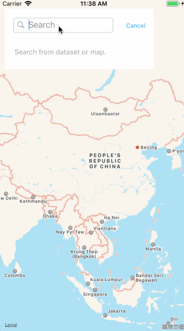

## Introduction

This is a demo for searching in Apple map, including local data searching and Apple map service data searching (using `MKLocalSearch`). The demo displays the searched results in a reasonable and graceful style.

The demo supports multiple layer data searching. That is, if the annotations on your map belong to multiple layers, the searched results will also include the layer info.

See the demo below.



## Usage
It is easy to use the search component in your application, you just need:

1. Load the map view and search view into your application.
2. Implement the `MSIMapSearchViewControllerDelegate` protocol.

### Load the map view and search view

Load the map view and search view in your view controller's `viewDidLoad` method:

```swift
self.addMapView()
self.addSearchView()
```
The implementation of the two methods are:

```swift
func addMapView() {
    self.mapView = MKMapView()
    self.mapView?.frame = self.view.bounds
    self.mapView?.autoresizingMask = [.flexibleWidth, .flexibleHeight]
    self.view.addSubview(self.mapView!)
}

func addSearchView() {
    let searchViewController = MSIMapSearchViewController(maxFrame: CGRect(x: 10, y: 20, width: 300, height: self.view.bounds.size.height - 20 - 20), delegate: self, mapView: self.mapView!)
    self.addChild(searchViewController)
    self.view.addSubview(searchViewController.view)
}
```

### Implementation the following protocol 

```swift
protocol MSIMapSearchViewControllerDelegate: class {
    func getAllAnnotationsInMap() -> [String: [CustomAnnotation]]
    func getLayerNames() -> [String]
    func highlightAnnotations(annotations: [String: [CustomAnnotation]])
}
```

`getAllAnnotationsInMap` is for retrieving all annotations in every layer: the dictionary key is the layer name, and the dictionary value is the annotations in the layer.

`getLayerNames` is for retrieving all the layers names which determines the layers' sequence.

`highlightAnnotations` is for highlighting the selected annotation in the map, which is selected in the searched results table view. This method is not implemented in the demo.

The `CustomAnnotation` is just for demo:

```swift
class CustomAnnotation {
    private var name: String

    init(name: String) {
        self.name = name
    }

    func getAnnotationDisplayName() -> String? {
        return self.name
    }
}
```

For a real application, you need to change this type to a type which extends `MKAnnotation` protocol and also has `getAnnotationDisplayName` method for searching.

## Notes

1. In the search results table view cell, if you want to add an icon in front of the annotation title, set `MSIMapSearchTableCellView.showIcon` to `true`. You can also customize the icon if you like.

2. The following two classes are not used in this demo, leaving it for further testing:

   * MSIMapSearchBarViewController
   * MSIMapSearchBarView